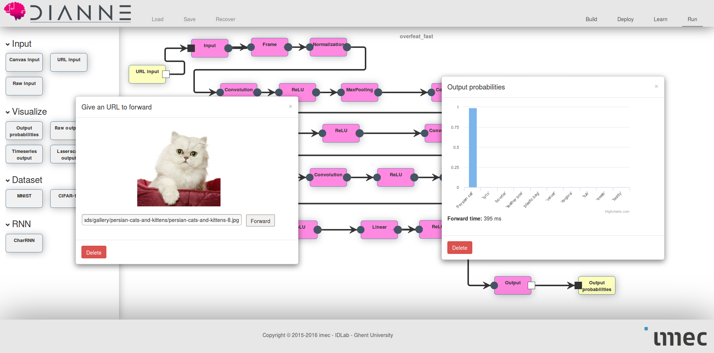

DIANNE examples
===============

This repository contains some example use case of what you can do with DIANNE.

In order to understand and run these examples, it is useful to first go through the [DIANNE getting started tutorial](http://dianne.intec.ugent.be/#gettingstarted).

Image Classification
--------------------

Examples on image classification in DIANNE.

  * [Handwritten digit classification](dianne.examples.lenet/README.md)
  * [Residual Neural Networks](dianne.examples.resnet/README.md)
  * [ImageNet image classification](dianne.examples.overfeat/README.md)	

Generative modelling
---------------------

These examples illustrate various generative modelling techniques.

  * [Variational Autoencoder](dianne.examples.vae/README.md)
  * [Generative Adverserial Networks](dianne.examples.gan/README.md)
  * [Text generation with LSTMs](dianne.examples.charrnn/README.md)

Reinforcement learning
----------------------

Examples on how to train deep reinforcement learning models in DIANNE.

  * [Deep Reinforcement Learning on OpenAI Gym](dianne.examples.rl.gym/README.md)
  * [Deep Q Learning on Arcade Learning Environment](dianne.examples.rl.ale/README.md)

