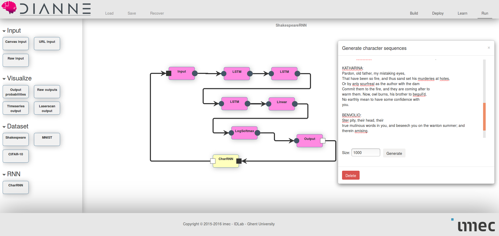

# Character generation with recurrent neural networks

An often recurring use case is processing sequence data. In particular, one is often interested in predicting x~t given previous data samples x~t-1 to x~t-n. This can be addressed with recurrent neural networks [1], that not only feed data forward into the network, but also have recurrent arrows in the structure. A particular example is character by character text generation, where the neural network has to predict the next character given the history.

## The Shakespeare dataset

A cool dataset to play with, is the Shakespeare dataset, that contains a subset of works of Shakespeare. As always, you can obtain the dataset using the following build command:

```
./gradlew datasets -Pwhich=Shakespeare
```

To get an idea of the dataset contents, here is a ground truth fragment:

```
First Citizen:
Before we proceed any further, hear me speak.

All:
Speak, speak.

First Citizen:
You are all resolved rather to die than to famish?

All:
Resolved. resolved.

First Citizen:
First, you know Caius Marcius is chief enemy to the people.

All:
We know't, we know't.

First Citizen:
Let us kill him, and we'll have corn at our own price.
Is't a verdict?
```

## Recurrent neural networks in DIANNE

To support recurrent neural networks in DIANNE, we have the `Memory` module, which saves an input at time `t`, the so called hidden state, to forward it at time `t+1`.

In practice one often uses memory cells like LSTM [3] or GRUs [4], that are more suited to capture long term dependencies in the data. A good introduction on recurrent neural networks and LSTM cells can be found [here](http://colah.github.io/posts/2015-08-Understanding-LSTMs/). In DIANNE, both LSTM and GRU modules are supported out of the box. Actually, one could create an LSTM module out of the basic DIANNE building blocks and the `Memory` module:


To train a recurrent neural network, an often used method is back propagation through time where the neural network is unfolded over several sequence steps and is trained as a regular feed forward network. In DIANNE, this behavior is provided through the `BPTTLearningStrategy`.

## Generating Shakespeare text

In this example, we have created a three layer LSTM network with 512 hidden units. The output of the network is a log probability of the next character in the text. To train the network, one can use the following command:

```
learn ShakespeareRNN Shakespeare strategy=BPTTLearninStrategy criterion=NLL method=ADAM batchSize=100 sequenceLength=50 clean=true trace=true traceInterval=1 backpropAll=true tag=lstm
```

Let's break down the command:

* learn : we start a learn job
* ShakespeareRNN : we will train the ShakespeareRNN neural network
* Shakespeare : the dataset to train on
* strategy=BPTTLearninStrategy : we are using the backpropagation through time strategy
* criterion=NLL : the outputs of the neural net are log probabilities, so use negative log likelihood loss criterion 
* method=ADAM : we train using ADAM
* batchSize=100 : in batches of 100 samples
* sequenceLength=50 : in each training step we unfold a sequence of length 50
* clean=true : we want to start from clean weights
* backpropAll=true : we add a loss term on each sequence step, not just on the last step
* tag=lstm : we provide a custom lstm tag to refind the weights after

Finally, we can deploy our network and generate sequences. In the run tab, there is a CharRNN block, that allows you to get the output from the neural network, sample a character from that distribution, and provide this as input for sampling the next character and so forth. You can type in an initial seed an determine the number of characters that should be generated. We also provided pretrained default weights for this neural network.



The resulting text has the structure of a shakespeare play and looks like old English.


## References

[[1]](https://arxiv.org/abs/1308.0850) Alex Graves, Generating Sequences With Recurrent Neural Networks

[[2]](https://github.com/karpathy/char-rnn) Tiny shakespeare dataset

[[3]](http://dl.acm.org/citation.cfm?id=1246450) Sepp Hochreiter, Jürgen Schmidhuber, Long Short-Term Memory

[[4]](https://arxiv.org/abs/1412.3555) Junyoung Chung, Caglar Gulcehre, KyungHyun Cho, Yoshua Bengio, Empirical Evaluation of Gated Recurrent Neural Networks on Sequence Modeling