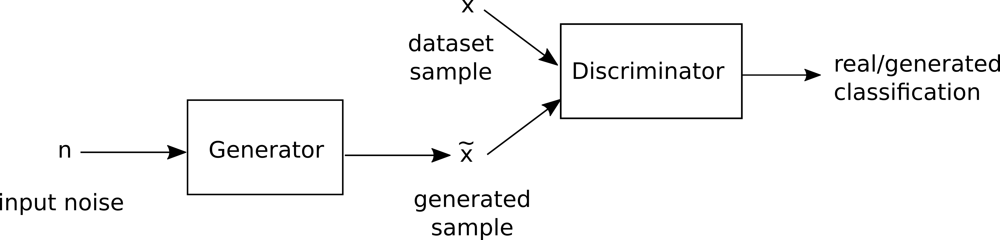

# Generative Adverserial Networks

The Generative Adverserial framework provides a way to approximate a dataset distribution by playing a min-max game between a Generator and a Discriminator. The Generator generates new fake samples which are fed into the Discriminator. The goal of the Discriminator is to classify the difference between real and generated samples, while the Generator tries to fool the Discriminator. By training both networks at the same time, the Generator will ultimately generate samples according to the true dataset distribution, in order to make the Discriminator unable to distinguish real from fake samples.

~

## Implementing GAN in DIANNE

Implementing a new training method in DIANNE is straightforward: one only has to implement a new `LearningStrategy`. This interface comprises of two methods. A `setup` method where all initialization happens and where configuration options can be injected into the strategy, and a `processIteration` method that is called each learning step. We provide a basic GAN implementation in DIANNE:

```
public class GANLearningStrategy implements LearningStrategy {

	protected Dataset dataset;
	
	protected NeuralNetwork generator;
	protected NeuralNetwork discriminator;
	
	protected GANConfig config;
	
	protected GradientProcessor gradientProcessorG;
	protected GradientProcessor gradientProcessorD;

	protected Criterion criterion;
	protected BatchSampler sampler;
	
	protected Tensor target;
	protected Tensor random;
	
	@Override
	public void setup(Map<String, String> config, Dataset dataset, NeuralNetwork... nns) throws Exception {
		this.dataset = dataset;
		
		this.generator = nns[0];
		this.discriminator = nns[1];
		
		this.config = DianneConfigHandler.getConfig(config, GANConfig.class);

		sampler = new BatchSampler(dataset, this.config.sampling, config);
		criterion = CriterionFactory.createCriterion(CriterionConfig.BCE, config);
		gradientProcessorG = ProcessorFactory.createGradientProcessor(this.config.method, generator, config);
		gradientProcessorD = ProcessorFactory.createGradientProcessor(this.config.method, discriminator, config);
		
		target = new Tensor(this.config.batchSize, 1);
		random = new Tensor(this.config.batchSize, this.config.generatorDim);
	}

	@Override
	public LearnProgress processIteration(long i) throws Exception {
		// Clear delta params
		generator.zeroDeltaParameters();
		discriminator.zeroDeltaParameters();
		
		// First update the discriminator
		
		// Load minibatch of real data for the discriminator 
		Batch batch = sampler.nextBatch();
		
		// These should be classified as correct by discriminator
		target.fill(0.85f);
		
		Tensor output = discriminator.forward(batch.input);
		float d_loss_real = TensorOps.mean(criterion.loss(output, target));
		Tensor gradOutput = criterion.grad(output, target);
		discriminator.backward(gradOutput);
		
		// Keep gradients to the parameters
		discriminator.accGradParameters();
		
		// Now sample a minibatch of generated data
		random.randn();
		// these should be classified as incorrect by discriminator
		target.fill(0.15f);
		Tensor generated = generator.forward(random);
		output = discriminator.forward(generated);
		float d_loss_fake = TensorOps.mean(criterion.loss(output, target));
		gradOutput = criterion.grad(output, target);
		discriminator.backward(gradOutput);
		
		// Update discriminator weights
		discriminator.accGradParameters();
		
		// Run gradient processors
		gradientProcessorD.calculateDelta(i);
		
		discriminator.updateParameters();
		
		// Now update the generator
		random.randn();
		// This should be classified correct by discriminator to get the gradient improving the generator
		target.fill(0.85f);
		generated = generator.forward(random);
		output = discriminator.forward(generated);
		
		float g_loss = TensorOps.mean(criterion.loss(output, target));
		gradOutput = criterion.grad(output, target);
		Tensor gradInput = discriminator.backward(gradOutput);
		generator.backward(gradInput);
		
		// Update generator weights
		generator.accGradParameters();
		
		// Run gradient processors
		gradientProcessorG.calculateDelta(i);
		
		// Update parameters
		generator.updateParameters();
		
		return new LearnProgress(i, g_loss);
	}

}
```

The `GANLearningStrategy` takes two neural networks: the generator and discriminator. Also notice the use of many built-in helper classes such as `BatchSampler` to fetch batches from the dataset, `Criterion` for building loss functions and `GradientProcessors` to calculate weight updates. 

## Using the GAN strategy

To use the GAN learning strategy, just provide it as the strategy in your learn command. This for example will train a GAN on our MNIST dataset:

```
learn Generator,Discriminator MNIST strategy=GANLearningStrategy generatorDim=10 batchSize=16 method=SGD learningRate=0.001 momentum=0.9 trace=true clean=true
```

During training, you can recover the Generator neural network in the DIANNE builder and visualize the outputs of the neural network. At first this is very noisy:

[GAN 1](figures/gan1.png) 
 
After a while, you can see the Generator starts to generate white background and a blob of potential handwritten digits:

[GAN 2](figures/gan2.png)

And ultimately you can start seeing actual handwritten digits:

[GAN 3](figures/gan3.png)

Try it out with a larger Generator and Discriminator network for generating more realistic samples and apply it on more complex datasets. 

[1](https://arxiv.org/abs/1406.2661) Ian J. Goodfellow, Jean Pouget-Abadie, Mehdi Mirza, Bing Xu, David Warde-Farley, Sherjil Ozair, Aaron Courville, Yoshua Bengio, Generative Adversarial Networks