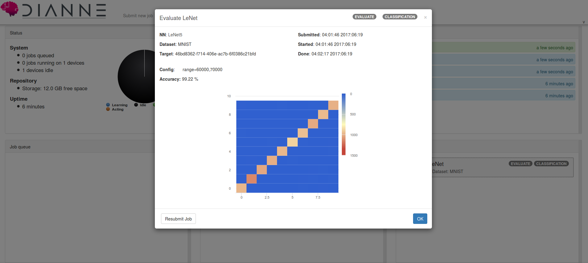

# Handwritten digit classification

In the [DIANNE tutorial on the website](http://dianne.intec.ugent.be/#builder) we show how to train a basic, fully connected neural network for MNIST digit classification. This achieved an accuracy of around 92%. In this example, we will train a convolutional neural network, which achieves accuracies of +99%.

## MNIST dataset

In this example will use the MNIST dataset. To import the MNIST dataset into your DIANNE workspace, execute the following build command in your workspace directory.

```
./gradlew datasets -Pwhich=MNIST
```

## LeNet5

One of the first convolutional neural networks was [LeNet5 by LeCunn et. al.](http://yann.lecun.com/exdb/lenet/). The neural network consists of 2 convolutional layers with 5x5 filters, the first one with 32 filters, the second with 64 filters, followed by a fully connected layer with 1024 hidden units. After each convolutional layer a 2x2 maxpool is added to reduce the spatial resolution. We use ReLU activation functions and end with a LogSoftmax for classification.


You can train the neural network the same way as the fully connected neural network from the tutorial. When running an evaluation on the test set you should be able to reach +99% accuracies:


