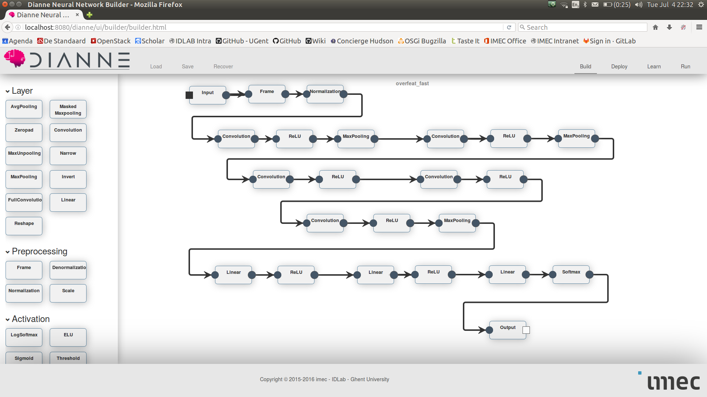

# Object recognition on ImageNet

In this example we will load the well known Overfeat neural network and fead it some images from the ImageNet dataset.

## ImageNet

ImageNet [1] provides a large dataset of images that are labeled according to the WordNet hierarchy. The yearly ImageNet challenge consists of various detection, recognition and localization tasks for computer vision. You can fetch the ImageNet validation set for DIANNE as follows:  

```
./gradlew datasets -Pwhich=ImageNetValidation
```

## Overfeat

Overfeat [2] is a well known convolutional neural network trained on the ImageNet dataset. In this example we provide DIANNE instances of both the fast and accurate Overfeat neural network:



Caveat: we cannot store the weights on github. You can download the weights from the DIANNE website for the (fast)[http://dianne.intec.ugent.be/models/overfeat_fast/] and (accurate)[http://dianne.intec.ugent.be/models/overfeat_accurate/] variants. Download all binary files and put them in the models/weights folder.
 
## Feeding images to Overfeat

Deploy the network, and feed images to it in the run tab to see the classifications it makes. You can also use the URL input to feed it images from the Internet:


[[1]](http://www.image-net.org/) ImageNet.

[[2]](https://arxiv.org/abs/1312.6229) Pierre Sermanet, David Eigen, Xiang Zhang, Michael Mathieu, Rob Fergus, Yann LeCun,  OverFeat: Integrated Recognition, Localization and Detection using Convolutional Networks.