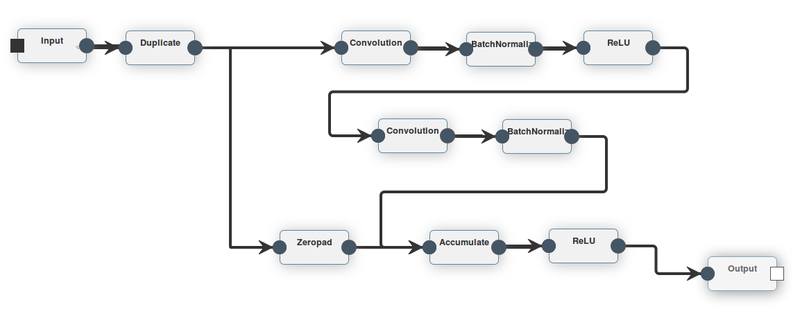
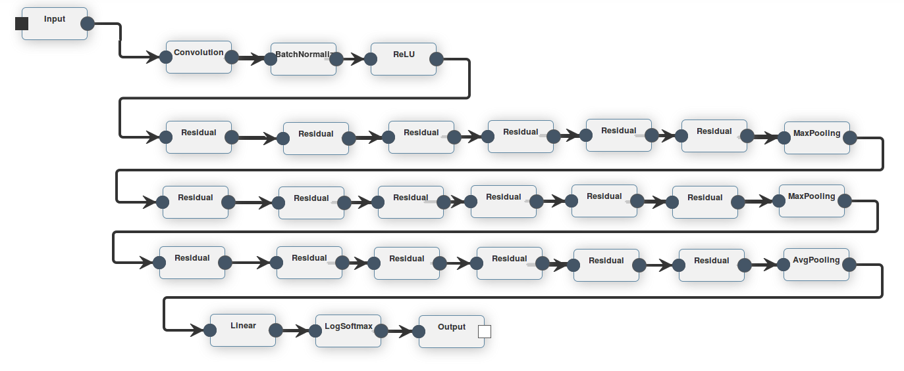
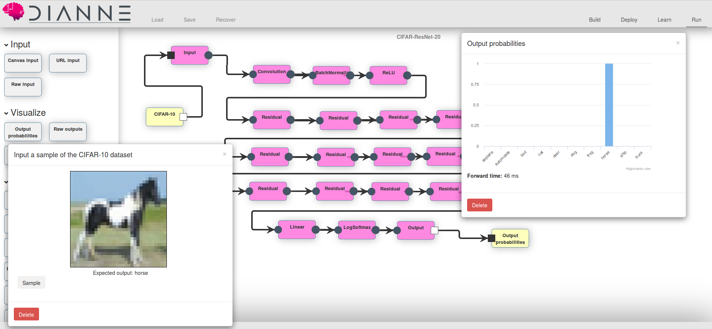

# Residual Neural Networks

In this example we will show how to train a ResNet in DIANNE on the CIFAR-10 dataset. We also show an example of a composite, a neural network defined in DIANNE that can be used as building block for defining larger neural network architectures.

## CIFAR-10

A well-known benchmark dataset is CIFAR-10, consisting of 60000 32x32 colour images in 10 classes, with 6000 images per class [1]. To import the CIFAR-10 dataset into your DIANNE workspace, execute the following build command in your workspace directory.

```
./gradlew datasets -Pwhich=CIFAR-10
```

## ResNets

Residual Networks (ResNets) [2] see neural network layers as learning residual functions with reference to the layer inputs, allowing for more deeper architectures. In order to design a ResNet, we introduce the Residual building block, defined as in [2]:



This neural network is parameterized by the number of input and output planes, and can be used as a composite to build a larger ResNet, such as the ResNet-20 example:


 

## Training your ResNet

The neural network can be trained using the default feedforward learner in DIANNE. You can submit a job via the Dashboard UI, or submit a command via the CLI:

```
g! learn CIFAR-ResNet-20 CIFAR-10  trainSet=0,45000 validationSet=45000,50000 criterion=NLL method=ADAM clean=true trace=true batchSize=128 hflip=0.5 cropHeight=32 cropWidth=32 cropPadding=4 tag=resnet
```
Let's break down the command:
* learn : we are starting a learn job
* CIFAR-ResNet-20 : the neural network we are training
* CIFAR-10 : the dataset to use
* trainSet=0,45000 : we will train on the first 45k images
* validationSet=45000,50000 : use 5k images as validation set
* criterion=NLL : use Negative Log Likelihood criterion 
* method=ADAM : use ADAM optimizer 
* clean=true : start from clean weights 
* trace=true : trace some output during training 
* batchSize=128 : use a batchSize of 128 
* hflip=0.5 : horizontally flip the input image with a probability of 50%
* cropHeight=32 cropWidth=32 cropPadding=4 : pad the image with 4 pixels and then generate random 32x32 crops to train on
* tag=resnet : tag the weights with our own tag "resnet"

This should converge to similar results from the paper. You can experiment with deeper/wider ResNets to further improve accuracy.

In the end you should be able to test your neural network in the "Run" tab of the builder.



## References

[[1]](https://www.cs.toronto.edu/~kriz/cifar.html) CIFAR datasets.

[[2]](https://arxiv.org/abs/1512.03385) Kaiming He, Xiangyu Zhang, Shaoqing Ren, Jian Sun, Deep Residual Learning for Image Recognition.