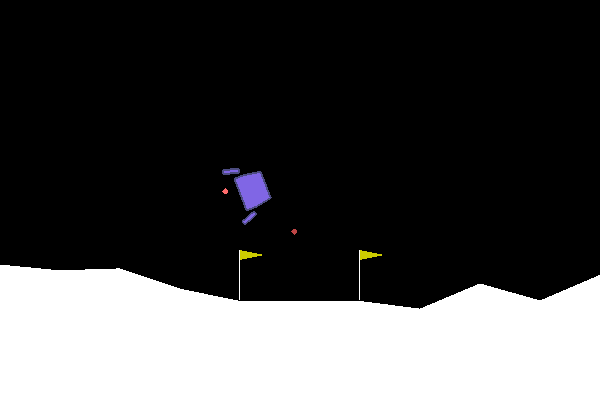
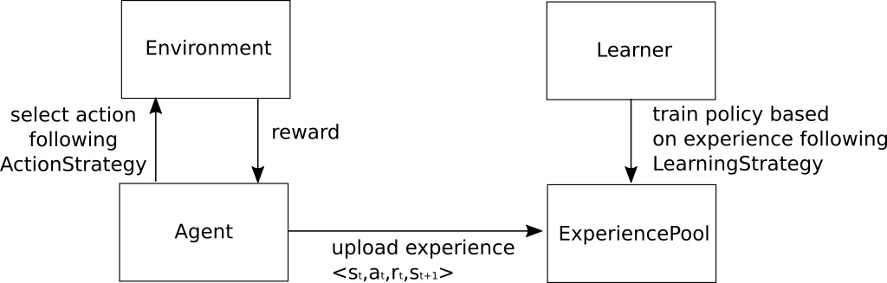
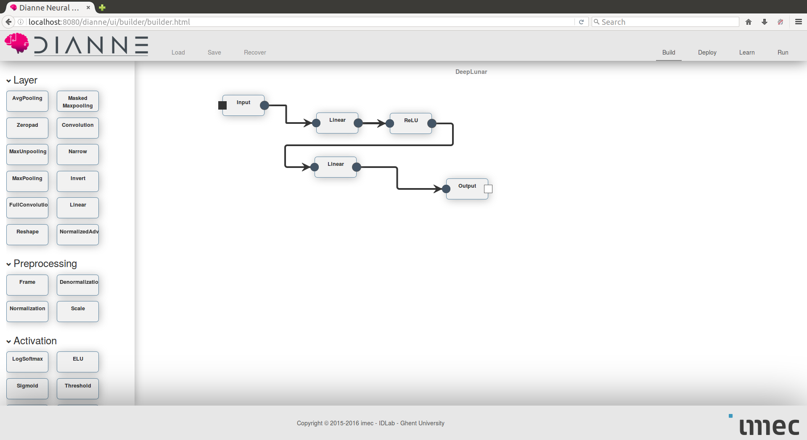
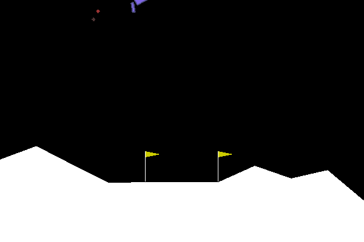

# Deep Reinforcement Learning on OpenAI Gym

In this example we will show how to run deep reinforcement learning algorithms in DIANNE with the OpenAI Gym.

## Setup

### Installing OpenAI Gym

The [OpenAI Gym](https://gym.openai.com) [1] is a Python toolkit for reinforcement learning research containing a wide range of environments to solve with an AI agent. Make sure you have Python installed on your system. We will cover the instructions for a system with Python 2.7, but it should be similar for Python 3.5.

The DIANNE OpenAI Gym environments are enabled through Java Embedded Python (JEP), a native interface enabling to call Python code from Java through CPython. Install Jep using pip:

```
pip install jep
```

Next install OpenAI Gym with the box2d environments. 
 
```
git clone https://github.com/openai/gym.git
cd gym
pip install -e .
pip install -e '.[box2d]'
```

For more detailed instructions, take a look at the [OpenAI Gym documentation](https://github.com/openai/gym#installation)
 
In order to run Jep from your OSGi runtime on Linux, make sure you have the LD_PRELOAD environment variable defined to the Python 2.7 library .so:

```
export LD_PRELOAD=/usr/lib/x86_64-linux-gnu/libpython2.7.so
```

### Starting DIANNE runtime

Start DIANNE using the `gym.bndrun` run file in this project. This file extends the default DIANNE run configuration, complemented with `rl.*` bundles as well as the gym environment bundle. You should get shell where you can interact with DIANNE using the command line:

```
g! environments
Available environments:
[1] Gym
```

### Launching an environment

Launching an environment in DIANNE is done with the `act` command. This takes the following arguments:

```
act <neural networks> <environment> <experience pool> [<key>=<value> ...]
```

* <neural-networks> is (a list of) neural network(s) that you need to translate an observation to an action, or null if no neural network is required
* <environment> is the environment to act on, in our case this is Gym
* <experience pool> the experience pool to store each <state, action, next state, reward> tuple in, which can be used for training a policy as we will discuss later
* any other properties can be provided as additional <key>=<value> pairs, most notable are:
	* strategy=<strategy> : the action strategy to use, for example RandomActionStrategy or GreedyActionStrategy
	* env=<gym env> : the Gym environment you want to load
	
For example, to launch the LunarLander environment that is available in OpenAI Gym, with a RandomActionStrategy that just takes some random actions, run:

```
act null Gym null env=LunarLander-v2 strategy=RandomActionStrategy
``` 

Now you should see a LunarLander that crashes into the void :-)



You can stop the job using the `dianne:stop` command or using the web interface pointing your browser to `localhost:8080/dianne/dashboard`.

Tip: you can also have a CLI appear in the dashboard web interface by pulling down the header clicking on the arrow on the right or pressing by F10.


## Reinforcement learning in DIANNE

DIANNE provides a number of components to support deep reinforcement learning. We integrate with a number of Environments, such as OpenAI Gym, Aracade Learning Environment, or the V-REP simulator for robotics simulations. The Agent component contains all logic to initialize and act upon an Environment. The Agent is provided with zero or more Neural Network instances and an ActionStrategy that defines how to take an action based upon the observations and the neural network(s). DIANNE comes with a number of predefined ActionStrategies such as (epsilon) greedy or Boltzmann exploration strategies useful in Q learning or OrnsteinUhlenbeck exploration in case of continuous actions. You can easily create your own strategy by implementing the ActionStrategy interface.



DIANNE also includes a number of off-policy reinforcement learning algorithms, that work with an ExperiencePool for experience replay. In this case the Agent uploads experience tuples containing the current state, action done, reward and next state to an ExperiencePool from which a Learner can sample experience to train upon. Similar to the Agent, the exact training procedure is implemented in a LearningStrategy that is used by the Learner. From time to time the Learner can sync his trained neural network weights with the Agent(s) using a syncInterval.   

## Deep Q Networks (DQN)

We will now use deep Q learning to train a neural network to control the lunar lander, using the DQN algorithm [2].

### Get ready to act

First we specify our ExperiencePool. We configure a pool LunarPool in the experience directory via a .json file:

```
{
	"name":"LunarPool",
	"type":"MemoryExperiencePool",
	"actionDims":[4],
	"stateDims":[8],
	"maxSize":100000
}
```

In case no such configuration file is found, DIANNE will try to automatically create an ExperiencePool at runtime.

Next, we specify our neural network. The LunarLander environment has 8 state variables and 4 possible actions an agent can take. Hence, we will define a simple single hidden layer neural network with 8 inputs, 4 outputs and 100 hidden units with ReLU activations. You can inspect (and change) the neural network in the DIANNE builder web UI:



Now, you can start the act job using the following command:

```
act DeepLunar Gym LunarPool env=LunarLander-v2 maxActions=500 strategy=GreedyActionStrategy epsilonDecay=1e-2 epsilonMin=0.1 trace=true tag=dqn
```

Let's break down the command:
* act : we are starting an act job
* DeepLunar : we are using an instance of the DeepLunar 
* Gym : we will be acting on the OpenAI Gym environment 
* LunarPool : the experience pool we configured to write the experience samples to
* env=LunarLander-v2 : the exact OpenAI Gym environment to configure
* maxActions=500 : end the roll-out after 500 actions, avoids the agent to get stuck in an never ending loop
* strategy=GreedyActionStrategy : use an epsilon greedy exploration strategy - the (discrete) action to take will be the arg max of the neural network output with probability 1-epsilon or a random action with probability epsilon
* epsilonDecay=1e-2 : we will decay epsilon over time using an exponential decay rate, starting at epsilon=1
* epsilonMin=0.1 : we stop decaying when the epsilon value is 0.1, to keep a little bit of exploration
* trace=true : we want to dump results to the console output to see what is happening 
* tag=dqn : we use neural network weights stored with this tag, this allows us to sync with the Learner and to differentiate weights of different experiments/runs


### Training our DQN network

In DQN, we want our neural network to approximate the optimal Q function, meaning we want the neural network for a given state to output for each action, the expected future return or Q-value. Our policy then becomes picking the action with the highest Q-value, hence the greedy action strategy in our agent.

For a given state transition <s,a,r,s'>, we can express the Q function as:


which is also known as the Bellmann equation, with discount factor gamma < 1 that defines how far in the future we should look. The main idea in Q-learning is that we can iteratively approximate the Q-function via the Bellman equation, using the right hand side of the equation as target for the left hand side. 

Let's start a Learner to train our Q network:

```
learn DeepLunar,DeepLunar LunarPool strategy=DeepQLearningStrategy discount=0.99 batchSize=32 method=RMSPROP criterion=HUB learningRate=1e-4 syncInterval=1000 clean=true tag=dqn
```

Let's again break down the command:

* learn : now we start a learn job
* DeepLunar,DeepLunar : we provide two instances of the DeepLunar network, since from [2] we know that learning is more stable when using a separate target network
* LunarPool : the ExperiencePool to sample from
* strategy=DeepQLearningStrategy : we use the DQN algorithm that is implemented in this strategy
* discount=0.99 : the discount factor
* batchSize=32 : the size of the minibatches for gradient descent
* method=RMSPROP : we train using RMSprop
* criterion=HUB : instead of mean squared error loss, we use Huber loss to avoid exploding gradients
* learningRate=1e-4 : the learning rate used
* syncInterval=100 : after each 1000 minibatches processed, the Learner will sync his weights, in this case this will sync both the target network as the neural network used by the agent 
* clean=true : start from new randomly initialized weights, set to false to continue with some previously trained weights
* tag=dqn : the tag used to store the neural network weights, make sure to use the same tag in the learn and act job 

You can now track the progress of your jobs in the DIANNE dashboard (point your browser to `localhost:8080/dianne/dashboard`). After a while the LunarLander should actually start landing between the two flags.

To check the policy without random actions, restart the act job with epsilon zero:

```
act DeepLunar Gym LunarPool env=LunarLander-v2 maxActions=500 strategy=GreedyActionStrategy epsilonMax=0 tag=dqn
```




[[1]](https://arxiv.org/abs/1606.01540) Greg Brockman, Vicki Cheung, Ludwig Pettersson, Jonas Schneider, John Schulman, Jie Tang, Wojciech Zaremba, OpenAI Gym.

[[2]](https://arxiv.org/abs/1312.5602) Volodymyr Mnih, Koray Kavukcuoglu, David Silver, Alex Graves, Ioannis Antonoglou, Daan Wierstra, Martin A. Riedmiller, Playing Atari with Deep Reinforcement Learning.
